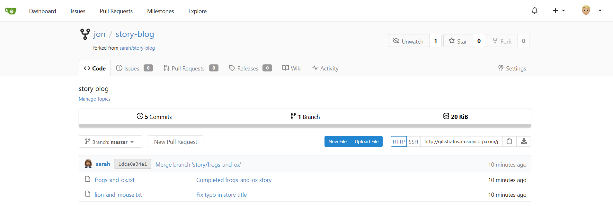

# Day 23 – Fork a Git Repository

## Task / Requirement
A new developer has joined the Nautilus project team and needs to start working on an existing Git repository. To enable independent development, the repository must be forked under the developer’s own account using the Git server UI.

**Requirement details:**
- Git platform: Gitea
- User: `jon`
- Source repository: `sarah/story-blog`
- Action: Fork the repository under user `jon`
- Constraint: Task must be completed using the web UI

---

## Steps Performed
- Accessed the Gitea web interface using the provided UI link
- Logged in with the credentials of user `jon`
- Navigated to the repository named `sarah/story-blog`
- Clicked on the **Fork** option from the repository page
- Selected user `jon` as the target account for the fork
- Completed the fork operation
- Verified that the repository was successfully created under the `jon` account

---

## Verification Screenshot

The following screenshot confirms that the repository `sarah/story-blog` was successfully forked under the `jon` user account:

---

## Expected Outcome
- A new repository named `story-blog` exists under the `jon` user account
- The forked repository contains the same code and commit history as `sarah/story-blog`
- User `jon` can now independently work on the project without affecting the original repository

---

## Key Learnings
- Forking creates a personal copy of an existing repository under a different user or organization
- A fork allows independent development without modifying the original repository
- Forks retain the full commit history of the source repository
- Forking is commonly used in collaborative and open-source workflows
- Git platforms provide UI-based mechanisms to manage repository ownership
