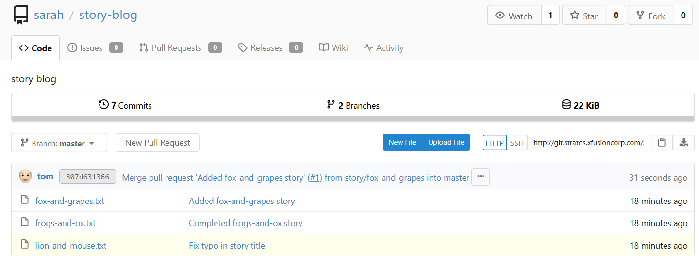

# Day 29 – Manage Git Pull Requests

## Task / Requirement
Direct pushes to the `master` branch are restricted to ensure that only reviewed and approved changes are merged. A developer named **Max** has pushed new changes to a feature branch and wants those changes to be merged into `master` using a proper Pull Request (PR) workflow.

The task is to create a Pull Request, assign a reviewer, review the changes, and merge them using the Git portal UI.

**Requirement details:**
- Git platform: Gitea
- Feature branch: `story/fox-and-grapes`
- Target branch: `master`
- PR title: `Added fox-and-grapes story`
- Reviewer: `tom`

---

## Steps Performed
- Logged into the Storage Server as user `max`
- Verified the cloned repository contents and commit history
- Confirmed that Max’s story exists in branch `story/fox-and-grapes`
- Validated commit author information and commit messages
- Accessed the Gitea web interface
- Logged in to the Git portal as user `max`
- Created a Pull Request from `story/fox-and-grapes` to `master`
- Provided the required Pull Request title
- Assigned user `tom` as a reviewer
- Logged out from the Git portal as user `max`
- Logged in to the Git portal as user `tom`
- Reviewed and approved the Pull Request
- Merged the Pull Request into the `master` branch
- Verified that the story was successfully merged

---

## Verification Screenshot

The following screenshot confirms that the Pull Request was reviewed, approved, and merged successfully into the `master` branch:

---

## Expected Outcome
- A Pull Request exists from `story/fox-and-grapes` to `master`
- Reviewer `tom` is assigned to the Pull Request
- Pull Request is reviewed and approved
- Changes are merged into the `master` branch
- `master` branch contains only reviewed and approved content

---

## Key Learnings
- Pull Requests enforce code review before merging into protected branches
- Feature branches allow developers to work independently
- Reviewers ensure quality and correctness before merge
- UI-based PR workflows are standard in collaborative development
- Restricting direct pushes to `master` improves repository stability
