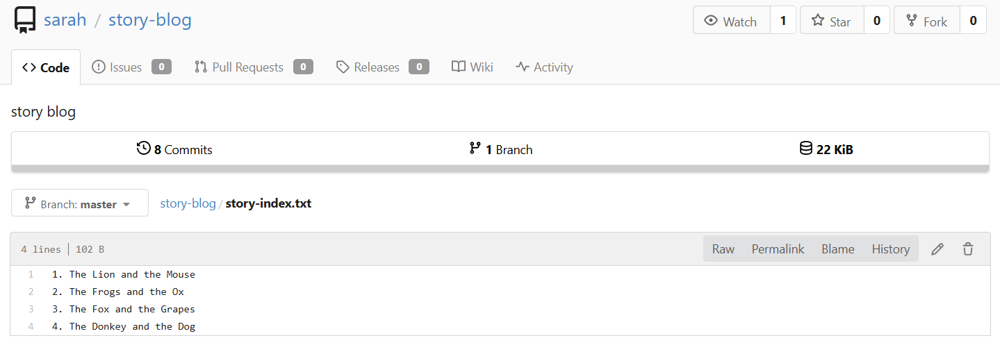

# Day 33 – Resolve Git Merge Conflicts

## Task / Requirement
Multiple developers were working on the same repository and pushed overlapping changes. When Max attempted to push his changes, Git reported conflicts due to updates already present in the remote `master` branch.

The task is to resolve the merge conflict correctly, ensure all story titles are present, fix a typo in one of the stories, and successfully push the changes to the remote repository.

**Requirement details:**
- Server: Storage Server (`ststor01`)
- User: `max`
- Repository path: `/home/max/story-blog`
- Branch: `master`
- File with conflict: `story-index.txt`
- Fix required:
  - Ensure titles for all **4 stories** are present
  - Correct typo: `Mooose` → `Mouse`

---

## Steps Performed
- Logged into the Storage Server as user `max`
- Navigated to the `story-blog` repository
- Verified local repository status and identified that local commits were ahead
- Attempted to push changes to the remote repository
- Observed push failure due to remote updates on `master`
- Pulled the latest changes from the remote repository
- Encountered a merge conflict in `story-index.txt`
- Opened the conflicted file and reviewed changes from both local and remote branches
- Resolved the conflict by:
  - Keeping titles for all four stories
  - Fixing the typo from `Mooose` to `Mouse`
- Saved the corrected file and marked the conflict as resolved
- Committed the merge resolution
- Successfully pushed the changes to the remote repository
- Verified changes through the Gitea web interface

---

## Commands Used

```bash
# Login to Storage Server
ssh max@ststor01

# Navigate to repository
cd /home/max/story-blog

# Check repository status
git status

# Attempt to push changes
git push origin master

# Pull latest changes from remote (merge conflict occurs)
git pull

# Edit conflicted file and resolve conflict
vi story-index.txt

# Check status after resolving conflict
git status

# Stage resolved file
git add story-index.txt

# Commit merge conflict resolution
git commit -m "update story-index.txt"

# Push changes to remote repository
git push origin master
```

---

## Verification Screenshot

The screenshot below confirms that the merge conflict was successfully resolved and the changes were pushed to the remote repository:



---

## Expected Outcome
- Merge conflict in `story-index.txt` is resolved successfully
- The file contains titles for **all four stories**
- Typo in the story title is corrected from `Mooose` to `Mouse`
- Changes are committed after conflict resolution
- Updates are pushed successfully to the remote `master` branch
- Remote repository reflects the corrected and merged content

---

## Key Learnings
- Merge conflicts occur when multiple developers modify the same lines in a file
- `git pull` can trigger merge conflicts if remote changes exist
- Conflict markers must be manually reviewed and resolved
- Files must be staged again after resolving conflicts
- Conflict resolution should preserve required changes from all contributors
- Verifying changes via the Git UI helps confirm successful collaboration

