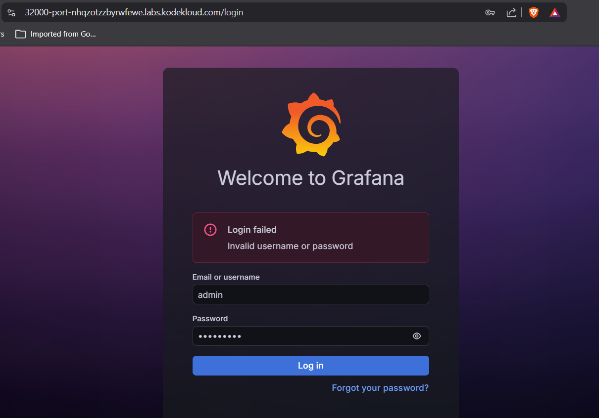

# Day 58 – Deploy Grafana on Kubernetes Cluster

## Task / Requirement
The DevOps team wants to deploy Grafana on a Kubernetes cluster to visualize and analyze application metrics. The requirement is to deploy Grafana using a Kubernetes Deployment and expose it externally using a NodePort Service.

No internal Grafana configuration is required; only accessibility of the login page needs to be verified.

**Requirement details:**
- Deployment name: `grafana-deployment-datacenter`
- Image: Any Grafana image
- Service type: `NodePort`
- NodePort: `32000`
- Kubernetes access: `kubectl` configured on jump host

---

## Steps Performed
- Created a Deployment manifest for Grafana
- Deployed the Grafana application to the Kubernetes cluster
- Created a NodePort Service to expose Grafana externally
- Verified Deployment and Pod status
- Accessed the Grafana login page using the NodePort exposure

---

## Commands Used

```bash
# Create Grafana deployment
kubectl apply -f deployment.yaml

# Create NodePort service
kubectl apply -f service.yaml

# Verify deployment
kubectl get deploy

# Verify pods
kubectl get pods

# Verify service and NodePort
kubectl get svc
```

---

## Expected Outcome
- Deployment `grafana-deployment-datacenter` is created successfully
- Grafana Pod reaches the Running state
- NodePort Service is created with port `32000`
- Grafana login page is accessible via NodePort
- No additional configuration inside Grafana is required

---

## Verification Screenshot
The following screenshot confirms that the Grafana login page is accessible via the NodePort service:



---

## Key Learnings
- Kubernetes Deployments are used to manage application lifecycle
- Services provide stable access to Pods
- NodePort exposes applications externally on a fixed port
- Monitoring tools like Grafana can be deployed easily on Kubernetes
- Application accessibility can be validated without internal configuration