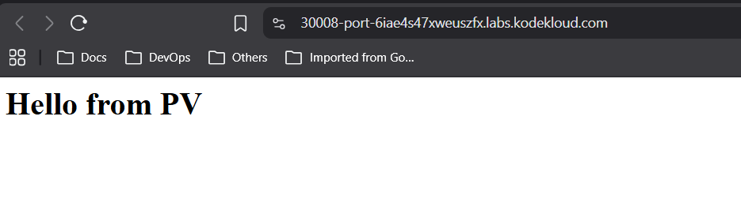

# Day 60 – Persistent Volumes in Kubernetes

## Task / Requirement
The Nautilus DevOps team is working on a Kubernetes template to deploy a web application on the cluster. There are some requirements to create/use persistent volumes to store the application code, and the template needs to be designed accordingly. Please find more details below:

- Create a PersistentVolume named as `pv-devops`. Configure the spec as storage class should be `manual`, set capacity to `5Gi`, set access mode to `ReadWriteOnce`, volume type should be `hostPath` and set path to `/mnt/security` (this directory is already created, you might not be able to access it directly, so you need not to worry about it).

- Create a PersistentVolumeClaim named as `pvc-devops`. Configure the spec as storage class should be `manual`, request `1Gi` of the storage, set access mode to `ReadWriteOnce`.

- Create a pod named as `pod-devops`, mount the persistent volume you created with claim name `pvc-devops` at document root of the web server, the container within the pod should be named as `container-devops` using image `nginx:latest` (remember to mention the tag i.e `nginx:latest`).

- Create a node port type service named `web-devops` using node port `30008` to expose the web server running within the pod.

Note: The `kubectl` utility on `jump_host` has been configured to work with the Kubernetes cluster.

---

## Steps Performed
- Created a PersistentVolume with hostPath storage
- Created a PersistentVolumeClaim requesting storage from the PV
- Verified successful PV–PVC binding
- Created a Pod using Nginx and mounted the PVC at the document root
- Created a NodePort Service to expose the application
- Verified that the application was accessible externally but faced 403 forbidden
- Checked container logs - `directory index of "/usr/share/nginx/html/" is forbidden` which means nginx root missing index.html file
- Exec into container and created a index.html file in root
- Verified that the application was accessible externally

---

## Commands Used

```bash
# Create PersistentVolume
kubectl apply -f pv-devops.yaml

# Create PersistentVolumeClaim
kubectl apply -f pvc-devops.yaml

# Verify PV and PVC status
kubectl get pv
kubectl get pvc

# Create Pod
kubectl apply -f pod-devops.yaml

# Create NodePort Service
kubectl apply -f service.yaml

# Verify pod and service
kubectl get pods
kubectl get svc

# Check container logs
kubectl logs pod-devops -c container-devops

# Exec into container
kubectl exec pod-devops -c container-devops -- sh

# Create an Index file
echo "<h1>Hello from PV</h1>" > /usr/share/nginx/html/index.html

# Verify PVC mount
kubectl exec -it pod-devops -- ls -l /usr/share/nginx/html
```

---

## Expected Outcome
- PersistentVolume `pv-devops` is created successfully
- PersistentVolumeClaim `pvc-devops` is bound to the PV
- Pod `pod-devops` runs using the bound persistent volume
- Nginx serves content from the mounted persistent volume
- NodePort Service `web-devops` exposes the application on port 30008
- Web application is accessible externally via the NodePort

---

## Verification Screenshot
The following screenshot confirms that the application backed by the PersistentVolumeClaim is accessible via the NodePort service:



---

## Key Learnings
- Kubernetes volumes are used to store data outside the container filesystem
- Data inside a container is lost when the Pod restarts unless a volume is used
- A PersistentVolume (PV) represents actual storage in the cluster
- A PersistentVolumeClaim (PVC) is a request for storage made by a Pod
- Pods do not use PVs directly; they always use PVCs
- `hostPath` volumes store data on the Kubernetes node
- Data in a `hostPath` volume remains even if the Pod is deleted
- `ReadWriteOnce` means the volume can be mounted by only one node at a time
- Persistent volumes allow applications to keep data across Pod restarts

## Difference between emptyDir, hostPath, and Persistent Volumes
- `emptyDir` is a **Pod-level temporary volume**
  - Created when the Pod starts
  - Deleted when the Pod is removed
  - Used for temporary data shared between containers in the same Pod

- `hostPath` is a **Node-level volume**
  - Maps a directory from the Kubernetes node into a Pod
  - Data persists even if the Pod is deleted
  - Data is lost if the Pod moves to another node
  - Suitable mainly for testing or single-node setups

- `PersistentVolume (PV)` is **cluster-managed storage**
  - Exists independently of Pods
  - Not deleted when Pods are deleted
  - Can be reused by different Pods via PVCs

---

### PersistentVolumeClaim (PVC)
- PVC is a request for storage by a Pod
- Pods never use PVs directly; they always use PVCs
- PVC binds to a matching PV based on size, access mode, and storage class

### What can be used as Persistent Volumes
- `hostPath` (for testing or labs)
- `NFS` (network shared storage)
- Cloud disks (EBS, Azure Disk, GCE Persistent Disk)
- CSI-based storage providers
- iSCSI and other block storage systems

### Key takeaways
- Use `emptyDir` for **temporary Pod-level data**
- Use `hostPath` for **node-specific storage**
- Use PV + PVC for **reliable, long-term storage**
- Persistent storage allows applications to survive Pod restarts