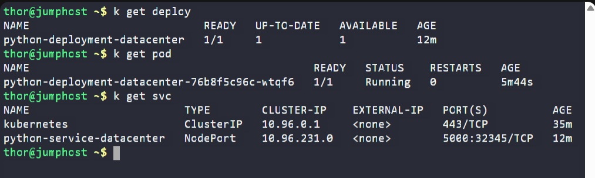
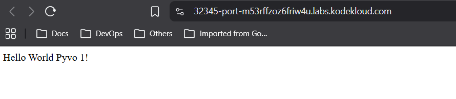

# Day 64 – Fix Python App Deployed on Kubernetes Cluster

## Task / Requirement
A Python application was deployed on the Kubernetes cluster, but due to misconfiguration, the application pods were not coming up and the service was not accessible.

Investigate the deployment and service issues, fix the misconfigurations, and ensure that the application is accessible via the specified NodePort.

**Requirement details:**
- Deployment name: `python-deployment-datacenter`
- Application image: `poroko/flask-demo-appimage`
- Service type: `NodePort`
- NodePort: `32345`
- Target port: Python Flask default port
- Application should be accessible externally

---

## Steps Performed
- Checked the deployment status and observed that no pods were running
- Described the pod and identified an image pull error due to an incorrect image name
- Verified the correct image name from the task instructions
- Updated the deployment to use the correct image
- Confirmed that the deployment and pod reached the running state
- Attempted to access the application and encountered a `502 Bad Gateway` error
- Inspected the running container and identified that the application was listening on port `5000`
- Reviewed the service configuration and found a mismatch in the `targetPort`
- Updated the service to map traffic to the correct container port
- Verified that the application was accessible successfully via the NodePort

---

## Expected Outcome
- Deployment `python-deployment-datacenter` is running with one healthy pod
- Service is correctly configured with:
  - NodePort `32345`
  - TargetPort `5000`
- The Python Flask application is accessible externally via the NodePort
- Application web page loads successfully without errors

---

## Verification

### Kubernetes Resources Status
The following screenshot confirms that the deployment, pod, and service are running successfully:

---

### Application Accessibility
The following screenshot confirms that the Python application is accessible via the NodePort:

## Key Learnings
- `ImagePullBackOff` occurs when Kubernetes cannot pull the container image due to incorrect image name, tag, or registry access issues
- Always verify the exact image name and tag specified in deployment manifests
- Container images must be accessible from the cluster for pods to start successfully
- A mismatch between service `targetPort` and the container’s listening port can cause gateway errors
- Systematic inspection of deployment, pod, and service resources helps quickly identify root causes

