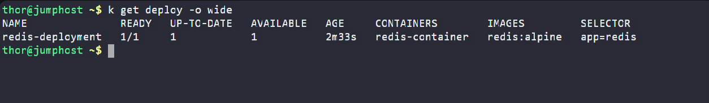

# Day 65 – Deploy Redis on Kubernetes

## Task / Requirement
The Nautilus application development team identified performance issues in an application running on Kubernetes and decided to introduce an in-memory caching solution. Redis was selected for initial testing before moving to production.

Deploy Redis on the Kubernetes cluster with the specified configuration and ensure the deployment is running successfully.

---

## Requirement Details

### ConfigMap
- Name: `my-redis-config`
- Configuration:
  - `redis-config` should contain `maxmemory 2mb`

---

### Redis Deployment
- Deployment name: `redis-deployment`
- Replicas: `1`
- Container:
  - Name: `redis-container`
  - Image: `redis:alpine`
- Resource requests:
  - CPU: `1`
- Exposed port:
  - `6379`
- Volumes:
  - EmptyDir volume:
    - Name: `data`
    - Mount path: `/redis-master-data`
  - ConfigMap volume:
    - Name: `redis-config`
    - Mount path: `/redis-master`

---

## Steps Performed
- Created a ConfigMap to store Redis configuration values
- Defined a Redis deployment using the specified image and container name
- Configured the deployment to run with a single replica
- Set CPU resource requests for the Redis container
- Mounted an `emptyDir` volume for Redis data storage
- Mounted the `ConfigMap` as a volume to provide Redis configuration
- Exposed the Redis container on the default Redis port
- Applied the configuration files to the Kubernetes cluster
- Verified that the Redis pod was running successfully

---

## Expected Outcome
- ConfigMap `my-redis-config` exists with the specified Redis configuration
- Redis deployment `redis-deployment` is created successfully
- One Redis pod is running and healthy
- Redis container is listening on port `6379`
- Redis is ready for testing as an in-memory caching service

### The following screenshot confirms that the redis deployment running successfully:

---

## Key Learnings
- ConfigMaps allow Redis configuration to be managed separately from the container image
- Redis stores all data in memory, which allows it to serve data extremely fast compared to disk-based databases
- Data in Redis is stored as key–value pairs and is commonly used for caching frequently accessed information
- Since Redis runs entirely in RAM, controlling memory usage is critical in containerized environments
- The `maxmemory` setting limits the maximum amount of memory Redis can use for storing data
- When Redis reaches the `maxmemory` limit, it either evicts old data or rejects new writes depending on its eviction policy
- Setting `maxmemory` helps prevent Redis pods from consuming excessive memory and getting terminated in Kubernetes
- `emptyDir` volumes are suitable for Redis because cache data is temporary and does not require persistence

