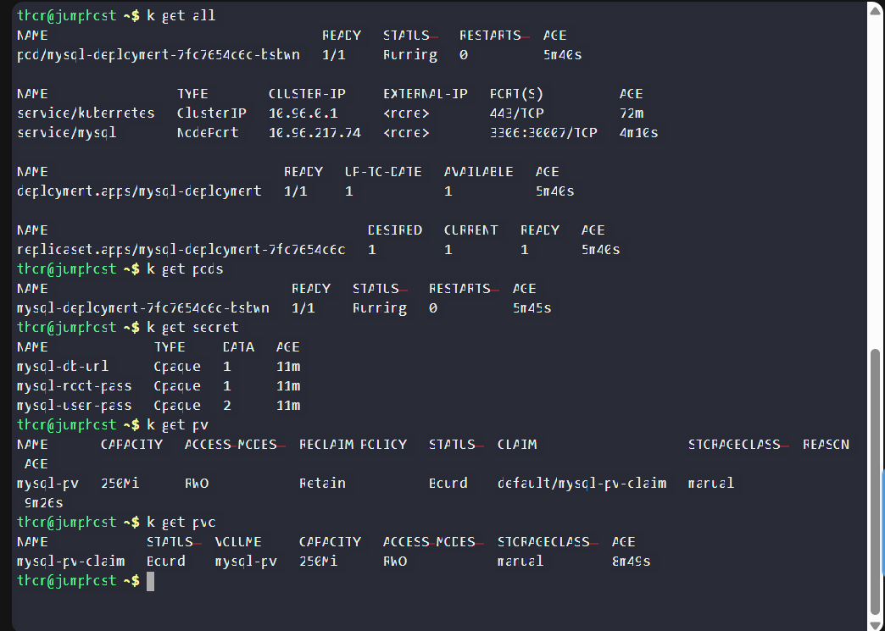

# Day 66 – Deploy MySQL on Kubernetes

## Task / Requirement
The Nautilus DevOps team finalized requirements to deploy a MySQL database on a Kubernetes cluster.  
The deployment must use persistent storage, secrets for credentials, and expose the database using a NodePort service.

---

## Requirement Details

### Persistent Volume
- Name: `mysql-pv`
- Capacity: `250Mi`
- Storage type and access modes: As per preference

---

### Persistent Volume Claim
- Name: `mysql-pv-claim`
- Requested storage: `250Mi`
- Bound to the PersistentVolume

---

### Secrets
- Secret name: `mysql-root-pass`
  - Key: `password`
  - Value: `YUIidhb667`

- Secret name: `mysql-user-pass`
  - Key: `username`
  - Value: `kodekloud_gem`
  - Key: `password`
  - Value: `GyQkFRVNr3`

- Secret name: `mysql-db-url`
  - Key: `database`
  - Value: `kodekloud_db10`

---

### MySQL Deployment
- Deployment name: `mysql-deployment`
- Image: Any MySQL image (as per preference)
- Persistent storage:
  - PVC: `mysql-pv-claim`
  - Mount path: `/var/lib/mysql`
- Environment variables:
  - `MYSQL_ROOT_PASSWORD` → from `mysql-root-pass` (key: password)
  - `MYSQL_DATABASE` → from `mysql-db-url` (key: database)
  - `MYSQL_USER` → from `mysql-user-pass` (key: username)
  - `MYSQL_PASSWORD` → from `mysql-user-pass` (key: password)

---

### Service
- Service name: `mysql`
- Type: `NodePort`
- NodePort: `30007`

---

## Steps Performed
- Created a PersistentVolume with the required storage capacity  
  (refer to [`mysql-pv.yaml`](./mysql-pv.yaml))
- Created a PersistentVolumeClaim to request and bind the persistent storage  
  (refer to [`mysql-pv-claim.yaml`](./mysql-pv-claim.yaml))
- Created Kubernetes secrets to store MySQL credentials securely  
  (refer to [`secrets.yaml`](./secrets.yaml))
- Defined a MySQL deployment and mounted the PersistentVolume at `/var/lib/mysql`  
  (refer to [`mysql-deploy.yaml`](./mysql-deploy.yaml))
- Configured MySQL environment variables using values sourced from Kubernetes secrets
- Created a NodePort service to expose the MySQL database externally  
  (refer to [`nodePort-svc.yaml`](./nodePort-svc.yaml))
- Verified that the MySQL pod was running and the persistent storage was correctly attached

---

## Expected Outcome
- PersistentVolume `mysql-pv` is created and bound to the claim
- PersistentVolumeClaim `mysql-pv-claim` is in bound state
- MySQL deployment is running successfully
- MySQL data is stored persistently under `/var/lib/mysql`
- MySQL service is accessible via NodePort `30007`
- Database credentials are securely managed using Kubernetes secrets

### Verification
The following screenshot confirms that all Kubernetes resources (PV, PVC, Deployment, Pod, and Service) are created and running successfully:

---

## Key Learnings
- PersistentVolumes and PersistentVolumeClaims provide durable storage for stateful applications
- Using PVCs decouples storage provisioning from application deployment
- Secrets allow sensitive information like passwords to be stored securely in Kubernetes
- Environment variables can safely consume secret values using `secretKeyRef`
- NodePort services expose databases externally for testing or development use
- Stateful workloads like databases should always use persistent storage
- Kubernetes Secrets of type `Opaque` are used to store generic sensitive data such as passwords, usernames, and database names
- `Opaque` secrets are the most commonly used secret type when no special format is required
- Other secret types include:
  - `kubernetes.io/dockerconfigjson` for container registry credentials
  - `kubernetes.io/tls` for TLS certificates and keys
  - `service-account-token` for API access by pods
- Secrets allow sensitive values to be injected into containers without hardcoding them in manifests
- Using `secretKeyRef` helps securely map secret values to environment variables
- PersistentVolumes and PersistentVolumeClaims enable stateful applications like MySQL to retain data across pod restarts
- Mounting the PVC at `/var/lib/mysql` ensures MySQL stores data in a persistent location
- Separating configuration (Secrets), storage (PV/PVC), and application logic (Deployment) improves maintainability and security
